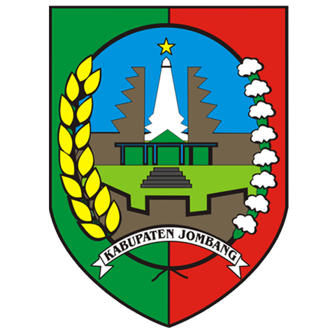
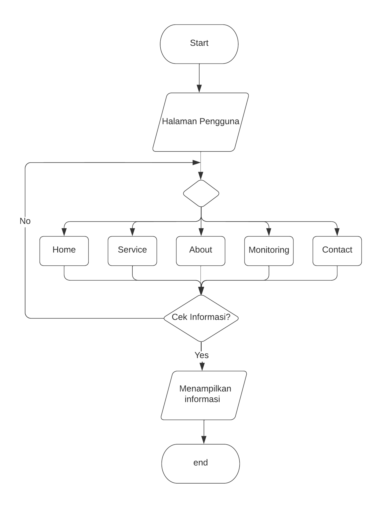

<h1 align="center">SIMPERA-SP | Sistem Pengendalian Pemeliharaan Sarana Prasarana</h1>

**SIMPERA-SP** merupakan **Sistem Informasi** yang digunakan untuk memonitoring pemeliharaan aset dan servis aset di Dinas Pemberdayaan Masyarakat dan Desa Kabupaten Jombang. Sistem ini dibangun untuk menunjang kegiatan operasional pemeliharaan sarana dan prasarana yang dimiliki oleh kantor DPMD Jombang, sehingga dapat dikelola secara efisien dan transparan.

## Daftar Isi

## Tentang SIMPERA-SP

**SIMPERA-SP** merupakan aplikasi berbasis web yang dibangun menggunakan **PHP**, **JavaScript**, **HTML**, **CSS**, serta **MySQL** sebagai basis data. Sistem ini dikembangkan dengan memanfaatkan **framework CodeIgniter 3** dan **Bootstrap** untuk mendukung tampilan yang responsif dan interaktif. 

Sistem ini menyediakan dua antarmuka utama:
1. **Halaman Pengunjung**: Digunakan oleh pegawai DPMD untuk memantau jalannya proses pemeliharaan sarana prasarana.
2. **Halaman Admin (Dashboard)**: Memberikan akses kepada admin untuk melakukan manajemen data aset, seperti AC, kendaraan, dan perangkat pengolah data.

Berikut adalah flowchart yang menggambarkan alur kerja dari SIMPERA-SP, mulai dari akses pengunjung hingga proses manajemen oleh admin:

