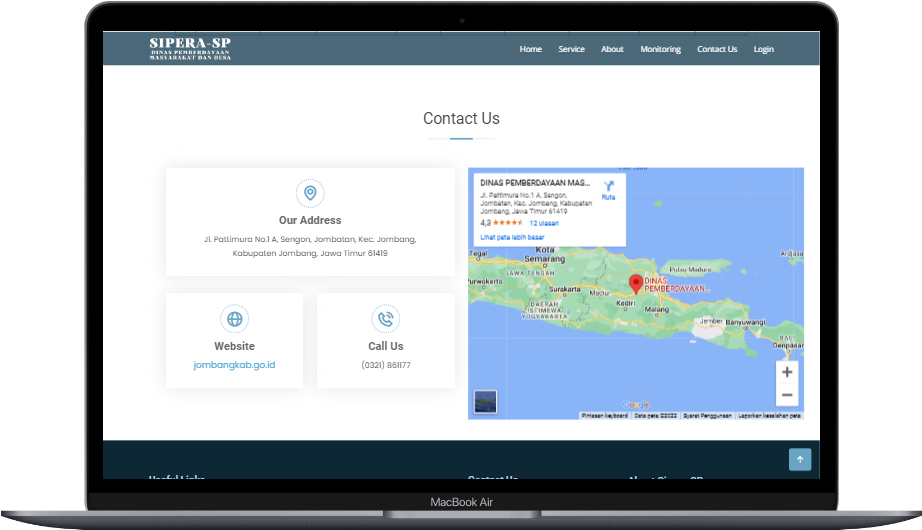

<p align="center"><a href="https://github.com/ZuyinatinK/SIMPERA-SP-DPMD-Kab-Jombang"></a></p>
<h1 align="center">SIMPERA-SP | Sistem Pengendalian Pemeliharaan Sarana Prasarana</h1>

**SIMPERA-SP** merupakan **Sistem Informasi** yang digunakan untuk memonitoring pemeliharaan aset dan servis aset di Dinas Pemberdayaan Masyarakat dan Desa Kabupaten Jombang. Sistem ini dibangun untuk menunjang kegiatan operasional pemeliharaan sarana dan prasarana yang dimiliki oleh kantor DPMD Jombang, sehingga dapat dikelola secara efisien dan transparan.

## Daftar Isi

## Preview 🚀

Halaman Pengunjung


Halaman Dashboard Admin


## Tentang SIMPERA-SP

**SIMPERA-SP** merupakan aplikasi berbasis web yang dibangun menggunakan **PHP**, **JavaScript**, **HTML**, **CSS**, serta **MySQL** sebagai basis data. Sistem ini dikembangkan dengan memanfaatkan **framework CodeIgniter 3** dan **Bootstrap** untuk mendukung tampilan yang responsif dan interaktif. 

Sistem ini menyediakan dua antarmuka utama:
1. **Halaman Pengunjung**: Digunakan oleh pegawai DPMD untuk memantau jalannya proses pemeliharaan sarana prasarana.
2. **Halaman Admin (Dashboard)**: Memberikan akses kepada admin untuk melakukan manajemen data aset, seperti AC, kendaraan, dan perangkat pengolah data.

<!-- Berikut adalah flowchart yang menggambarkan alur kerja dari SIMPERA-SP, mulai dari akses pengunjung hingga proses manajemen oleh admin:

<p align="center"></p>
<p align="center"></p> -->

## Fitur Utama

### 1. Halaman Pengunjung
Pengunjung adalah pegawai kantor Dinas Pemberdayaan Masyarakat dan Desa yang dapat memantau aktivitas pemeliharaan sarana dan prasarana. Fitur-fitur yang tersedia bagi pengunjung antara lain:
- **Home**: Informasi umum mengenai status pemeliharaan sarana.
- **Service**: Detail pemeliharaan sarana dan prasarana yang sedang berlangsung.
- **About**: Penjelasan tentang tujuan dan manfaat dari SIMPERA-SP.
- **Monitoring**: Laporan dan status pemeliharaan aset.
- **Contact**: Informasi kontak penting.

Pengunjung tidak perlu login untuk mengakses halaman ini.

### 2. Halaman Admin (Dashboard)
Admin memiliki hak akses lebih tinggi dan bertanggung jawab untuk mengelola data aset. Fitur-fitur penting untuk admin meliputi:
- **Manajemen Data AC**: Mengelola informasi dan status pemeliharaan AC.
- **Manajemen Data Kendaraan**: Mengelola data kendaraan dinas.
- **Manajemen Data Barang Pengolah Data**: Mengelola perangkat IT di kantor.
- **Monitoring Status Pemeliharaan**: Admin dapat memantau dan memperbarui status aset yang sedang dalam pemeliharaan.

## Teknologi yang Digunakan
- **PHP**: Untuk pengembangan backend dan logika aplikasi.
- **JavaScript & JQuery**: Untuk interaktivitas halaman dan komunikasi dengan server.
- **HTML5 & CSS3**: Untuk struktur dan tampilan halaman web.
- **Bootstrap 4**: Untuk layout dan desain responsif.
- **CodeIgniter 3**: Sebagai framework MVC yang digunakan untuk membangun sistem ini.
- **MySQL**: Untuk menyimpan data aset dan aktivitas pemeliharaan.

## Instalasi

1. **Clone repositori**:
   ```bash
   git clone https://github.com/ZuyinatinK/SIMPERA-SP-DPMD-Kab-Jombang.git
   ```
2. Konfigurasi database:
    - Buat database baru dengan nama `simpera_sp`. 
    - Import file `simpera_db.sql` yang terletak di folder ``database/``.
3. Konfigurasi CodeIgniter:
    - Sesuaikan file `application/config/config.php` dengan URL proyek Anda.
    ```bash
    $config['base_url'] = ((isset($_SERVER['HTTPS']) && $_SERVER['HTTPS'] == "on") ? "https" : "http");
    $config['base_url'] .= "://" . $_SERVER['HTTP_HOST'];
    $config['base_url'] .= str_replace(basename($_SERVER['SCRIPT_NAME']), "", $_SERVER['SCRIPT_NAME']);
    ```
    - Konfigurasi koneksi database di `application/config/database.php` pada bagian
    ```bash
    $db['default'] = [
    'dsn' => '',
    'hostname' => 'localhost',
	'username' => 'root',
	'password' => '',
	'database' => 'simpera_db',
	'dbdriver' => 'mysqli',
    'dbprefix' => '',
    'pconnect' => false,
    'db_debug' => ENVIRONMENT !== 'production',
    'cache_on' => false,
    'cachedir' => '',
    'char_set' => 'utf8',
    'dbcollat' => 'utf8_general_ci',
    'swap_pre' => '',
    'encrypt' => false,
    'compress' => false,
    'stricton' => false,
    'failover' => [],
    'save_queries' => true,
    ];
    ```
4. Jalankan di browser: Buka 
    ``` bash
    http://localhost/simpera-sp/ 
    ```
    di browser Anda untuk mengakses aplikasi.

## Penggunaan

- Halaman Pengunjung: Aktor pengunjung diakses tanpa login sehingga dapat melihat status pemeliharaan aset.
Berikut use case pengunjung.


- Halaman Admin: Login diperlukan untuk mengakses dashboard admin dan melakukan manajemen aset.
Berikut use case admin.


## Diagram Aktivitas

Perancangan Diagram Aktivitas dalam sistem SIMPERA-SP digunakan untuk memvisualisasikan alur aktivitas yang terjadi dalam sistem, dari awal aktivitas hingga selesai. Diagram aktivitas ini penting untuk memahami alur kerja sistem secara keseluruhan, termasuk interaksi antara aktor dan sistem.

### Aktivitas Admin
Admin dalam sistem SIMPERA-SP memiliki hak akses penuh untuk mengelola data terkait sarana dan prasarana di kantor Dinas Pemberdayaan Masyarakat dan Desa Kabupaten Jombang. Langkah awal yang dilakukan admin ketika mengakses sistem adalah menuju ke halaman login. Setelah berhasil login, admin akan diarahkan ke halaman dashboard, di mana admin dapat:

- Manajemen data AC: Admin dapat melakukan penambahan, penghapusan, dan pengeditan data terkait AC yang dimiliki oleh kantor.
- Manajemen kendaraan: Admin dapat mengelola data kendaraan dinas, termasuk pemeliharaan dan status kendaraan.
- Manajemen barang pengolah data: Admin juga memiliki akses untuk mengelola barang-barang terkait pengolah data, seperti komputer dan peralatan IT lainnya.

Diagram aktivitas berikut menjelaskan aliran kerja yang dilakukan oleh admin saat mengakses dan mengelola sistem:

- Diagram Aktivitas Manajemen AC


- Diagram Aktivitas Manajemen Kendaraan


- Diagram Aktivitas Manajemen Barang Pengolah Data


### Aktivitas Pengunjung
Pengunjung dalam sistem ini adalah aktor yang dapat memantau jalannya proses pemeliharaan tanpa perlu melakukan login. Pengunjung dapat mengakses beberapa fitur, seperti:

- Home: Halaman utama yang memberikan informasi umum tentang sistem dan pemeliharaan yang sedang berlangsung.
- Service: Informasi tentang layanan pemeliharaan.
- Monitoring: Pengunjung dapat melihat status terkini pemeliharaan sarana prasarana secara transparan.
- Contact: Halaman kontak untuk komunikasi lebih lanjut dengan admin.
- Pengunjung tidak memiliki hak akses untuk mengelola data, namun mereka dapat dengan mudah memantau proses yang sedang berjalan. 

Aktivitas pengunjung dapat dilihat dalam diagram berikut:


Diagram ini membantu memperjelas alur kegiatan pengunjung dalam sistem, mulai dari akses informasi hingga pemantauan proses.

## ERD (Entity Relationship Diagram) 

Entity Relationship Diagram (ERD) dalam sistem SIMPERA-SP dirancang untuk memvisualisasikan struktur basis data yang digunakan dalam sistem ini. ERD membantu memahami entitas-entitas yang ada dalam sistem serta bagaimana hubungan antar entitas tersebut. Diagram ini mencakup entitas, atribut, relationship, dan kardinalitas dari basis data.

Berikut ERD dalam sistem SIMPERA-SP.


ERD ini membantu dalam memetakan struktur basis data yang akan digunakan dalam sistem SIMPERA-SP, memastikan setiap komponen data yang penting dicatat dan dapat diakses dengan tepat.


## Preview WEB 

- Warning!


- Home (Halaman Utama)


- Service


- About


- Monitoring Manajemen Kendaraan


- Monitoring Manajemen AC


- Monitoring Manajemen Pengolah Data


- Contact



- Footer


- Login Admin


- Register Admin


- Profile Admin


- Dashboard Admin


- User Admin


- Dataset AC & History


- Dataset Kendaraan & History


- Dataset Pengolah Data & History


- About


## Kesimpulan

SIMPERA-SP adalah sistem informasi yang efektif untuk membantu Dinas Pemberdayaan Masyarakat dan Desa Kabupaten Jombang dalam memantau dan mengelola pemeliharaan sarana prasarana secara digital. Program ini memberikan kemudahan bagi pegawai untuk mengakses informasi terkait aset dan bagi admin untuk melakukan manajemen aset dengan lebih efisien. Dengan fitur yang lengkap, program ini dapat meningkatkan transparansi dan efektivitas operasional pemeliharaan sarana di kantor DPMD.